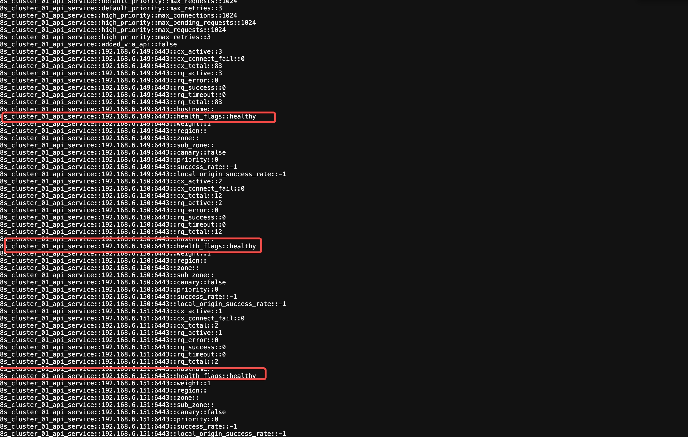

## 加入节点
```
kubeadm join --discovery-file config.yaml   --node-name=192.168.6.152 --v=2 
```


```
[root@localhost kubeadm]# kubectl get nodes
NAME            STATUS     ROLES           AGE   VERSION
192.168.6.149   NotReady   control-plane   38m   v1.28.12

[root@localhost kubeadm]# kubectl get po -A
NAMESPACE      NAME                                    READY   STATUS     RESTARTS   AGE
kube-flannel   kube-flannel-ds-d5q79                   0/1     Init:1/2   0          8s
kube-system    coredns-66f779496c-ggsmf                0/1     Pending    0          37m
kube-system    coredns-66f779496c-qvnbm                0/1     Pending    0          37m
kube-system    etcd-192.168.6.149                      1/1     Running    2          38m
kube-system    kube-apiserver-192.168.6.149            1/1     Running    2          38m
kube-system    kube-controller-manager-192.168.6.149   1/1     Running    0          38m
kube-system    kube-proxy-hq829                        1/1     Running    0          37m
kube-system    kube-scheduler-192.168.6.149            1/1     Running    2          38m

```

在cni就绪之前 node 不是就绪的 coredns是pending的


启动后可以看到 会下载几个镜像, 后面会对这几个东西一一讲解


```
I0803 15:13:52.772641   60815 checks.go:243] validating the existence and emptiness of directory /var/lib/etcd
[preflight] Pulling images required for setting up a Kubernetes cluster
[preflight] This might take a minute or two, depending on the speed of your internet connection
[preflight] You can also perform this action in beforehand using 'kubeadm config images pull'
I0803 15:13:52.773040   60815 checks.go:828] using image pull policy: IfNotPresent
I0803 15:13:52.825688   60815 checks.go:854] pulling: registry.aliyuncs.com/google_containers/kube-apiserver:v1.28.12
I0803 15:14:03.307491   60815 checks.go:854] pulling: registry.aliyuncs.com/google_containers/kube-controller-manager:v1.28.12
I0803 15:14:06.399070   60815 checks.go:854] pulling: registry.aliyuncs.com/google_containers/kube-scheduler:v1.28.12
I0803 15:14:10.044084   60815 checks.go:854] pulling: registry.aliyuncs.com/google_containers/kube-proxy:v1.28.12
I0803 15:14:11.253916   60815 checks.go:854] pulling: registry.aliyuncs.com/google_containers/pause:3.9
I0803 15:14:17.451895   60815 checks.go:854] pulling: registry.aliyuncs.com/google_containers/etcd:3.5.12-0
I0803 15:14:17.451895   60815 checks.go:854] pulling: registry.aliyuncs.com/google_containers/coredns:v1.10.1
```

## Kubernetes 核心组件列表

| 组件名称 | 作用 |  |
|---------|------|------|
| **kube-apiserver** | Kubernetes API服务器，集群的统一入口 |  |
| **kube-controller-manager** | 控制器管理器，负责维护集群状态 |  |
| **kube-scheduler** | 调度器，负责Pod调度决策 |  |
| **kube-proxy** | 网络代理，实现Service网络 |  |
| **pause** | 容器运行时基础镜像 |  |
| **etcd** | 分布式键值存储，集群数据存储 |  |
| **coredns** | DNS服务，集群内服务发现 |  |

## 启动完所有 控制面kubelet后可以看到 envoy中3个endpoint都标记为healthy了




